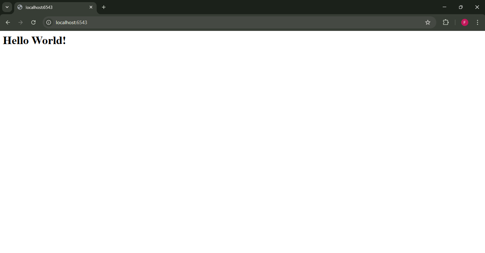

# Analisis Step 02: Python Packages (Structuring)

## Apa yang Dilakukan?
Pada langkah ini, kita tidak mengubah fungsionalitas aplikasi. Kita hanya **mengatur ulang** file-file kita ke dalam struktur *package* Python yang lebih formal.

Kita membuat folder `tutorial/` untuk menyimpan kode aplikasi kita (`app.py`) dan file `__init__.py` (kosong) untuk menandainya sebagai sebuah *package*.

Kita juga membuat file `setup.py` di level atas (`02-packaging/`) yang bertujuan untuk mendaftarkan dependensi proyek kita (`pyramid` dan `waitress`).

## Konsep

1.  **`setup.py`**:
    Untuk *step* ini, `setup.py` memiliki satu fungsi utama: mendefinisikan daftar `requires`. Ketika kita menjalankan `pip install -e .`, `pip` akan membaca file ini dan meng-install `pyramid` dan `waitress` untuk kita. Perhatikan bahwa file ini **belum** memiliki `entry_points`; itu akan ditambahkan di *step* selanjutnya.

2.  **`tutorial/app.py`**:
    Ini adalah file yang *sama persis* dengan yang kita gunakan di Step 01. Logikanya belum diubah, hanya lokasinya yang dipindahkan.

3.  **`tutorial/__init__.py`**:
    File ini (saat ini) kosong. Keberadaannya hanya untuk memberi tahu Python bahwa folder `tutorial` adalah sebuah *package* yang bisa diimpor, bukan sekadar folder biasa.

## Cara Menjalankan

Menjalankan *step* ini terdiri dari 2 bagian: meng-install dependensi, lalu menjalankan aplikasi dari lokasi barunya.

1.  Pastikan *virtual environment* (`env`) sudah aktif.
2.  Masuk ke direktori yang berisi file `setup.py`:
    ```bash
    cd 02-packaging
    ```
3.  **Install Dependensi**
    Jalankan perintah ini untuk meng-install `pyramid` dan `waitress` sesuai `setup.py`:
    ```bash
    pip install -e .
    ```
    (Tanda `-e` artinya "editable". Tanda `.` artinya "proyek di folder ini".)

4.  **Jalankan Aplikasi**
    Setelah instalasi selesai, jalankan file `app.py` yang ada di dalam folder `tutorial`:
    ```bash
    python tutorial/app.py
    ```
5.  Buka *browser* dan kunjungi `http://localhost:6543`. Hasilnya akan sama persis dengan Step 01.

## Bukti Screenshot

(Tempelkan dua screenshot Anda di sini):
1.  Terminal setelah berhasil menjalankan `pip install -e .`.

2.  Terminal yang menjalankan `python tutorial/app.py` dan *browser* yang menampilkan "Hello World!"
