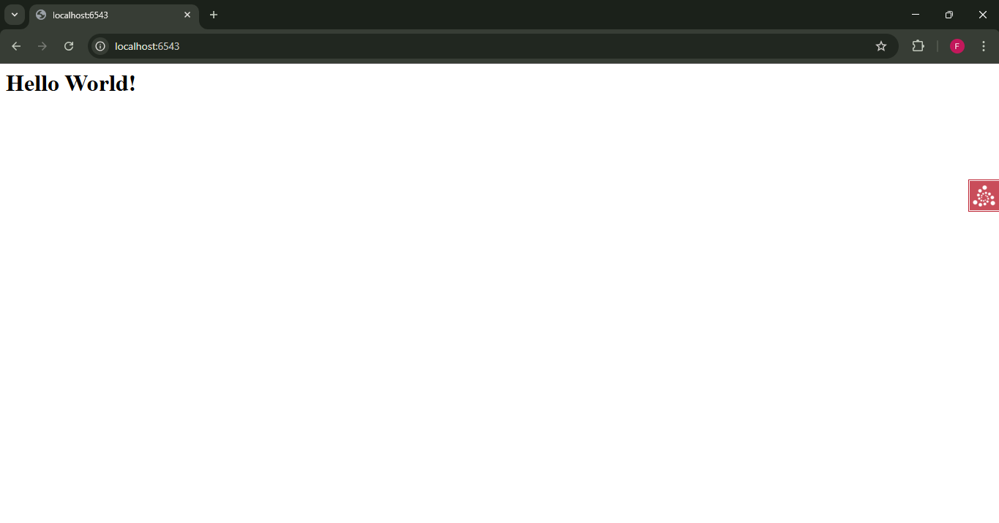

# Analisis Step 04: Debug Toolbar

## Apa yang Dilakukan?
Pada langkah ini, kita menambahkan *add-on* Pyramid yang sangat berguna, yaitu `pyramid_debugtoolbar`. Ini adalah paket Python yang tersedia di PyPI. Kita juga belajar cara meng-install dependensi "opsional" atau "pengembangan" menggunakan fitur `extras_require` dari `setuptools`.

## Konsep

1.  **`pyramid_debugtoolbar`**:
    Ini adalah paket Python eksternal yang berfungsi sebagai *add-on* untuk Pyramid. Tujuannya adalah menyediakan *toolbar* di sisi *browser* untuk membantu *debugging*. Kita bisa melihat *request*, *header*, *traceback* (jika ada error), dan banyak lagi.

2.  **`setup.py` dan `extras_require`**:
    Daripada menambahkan `pyramid_debugtoolbar` ke daftar `requires` utama, kita menambahkannya sebagai "ekstra". Ini adalah praktik yang baik. `requires` adalah dependensi *minimum* agar aplikasi berjalan. `extras_require` adalah untuk dependensi *opsional*, seperti alat *testing* atau *debugging* yang tidak diperlukan di server produksi.
    * Kita membuat kunci `'dev'` yang berisi daftar `dev_requires`.
    * Kita meng-install-nya dengan perintah khusus: `pip install -e ".[dev]"`.

3.  **`development.ini` dan `pyramid.includes`**:
    Meng-install *package* saja tidak cukup. Kita harus memberi tahu aplikasi Pyramid kita untuk "mengaktifkan" atau "menggunakan" *add-on* tersebut.
    * `pyramid.includes = pyramid_debugtoolbar` adalah cara berbasis konfigurasi untuk memberi tahu Pyramid agar memuat konfigurasi dari *package* `pyramid_debugtoolbar` saat aplikasi dimulai.
    * Alternatifnya (yang tidak kita lakukan) adalah menggunakan `config.include('pyramid_debugtoolbar')` di dalam file `__init__.py` kita. Menggunakan `.ini` lebih disukai karena memudahkan kita menonaktifkan *toolbar* di produksi tanpa mengubah kode.

## Cara Menjalankan

1.  Pastikan *virtual environment* (`env`) sudah aktif.
2.  Masuk ke direktori `04-debug-toolbar`.
3.  Install proyek beserta dependensi "dev" opsionalnya:
    ```bash
    pip install -e ".[dev]"
    ```
4.  Jalankan server menggunakan `pserve`:
    ```bash
    pserve development.ini --reload
    ```
5.  Buka *browser* dan kunjungi `http://localhost:6543`.
6.  Perhatikan logo `>` kecil di sisi kanan halaman.

## Bukti Screenshot
