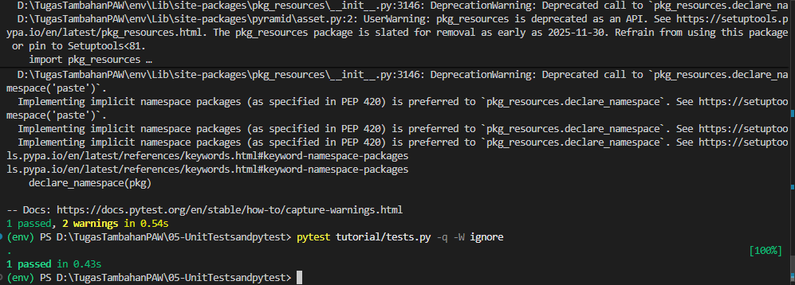

# Analisis Step 05: Unit Testing

## Apa yang Dilakukan?
Pada langkah ini, kita menambahkan *framework* *testing* bernama `pytest` ke dalam dependensi pengembangan (`[dev]`) kita. Kita kemudian membuat file *test* baru (`tutorial/tests.py`) yang berisi satu "unit test" untuk *view* `hello_world` kita.

Tujuan dari *test* ini adalah untuk memverifikasi bahwa *view* kita mengembalikan respons HTTP yang sukses (status code 200) ketika dipanggil.

## Konsep

1.  **`pytest`**:
    Ini adalah *framework* *testing* Python yang populer. Kita menambahkannya ke `dev_requires` di `setup.py` karena *testing* adalah sesuatu yang kita lakukan selama pengembangan, bukan bagian dari aplikasi inti di produksi.

2.  **`unittest.TestCase`**:
    File `tests.py` kita mengimpor `unittest`, *framework* *unit testing* standar bawaan Python. *Test* kita dibuat sebagai *class* (`TutorialViewTests`) yang mewarisi dari `unittest.TestCase`.

3.  **`pyramid.testing`**:
    Pyramid menyediakan *helper* (pembantu) *testing*-nya sendiri untuk mempermudah.
    * `testing.setUp()` dan `testing.tearDown()`: Fungsi-fungsi ini (yang kita panggil di `setUp` dan `tearDown`) menyiapkan lingkungan konfigurasi Pyramid minimal untuk *testing*.
    * `testing.DummyRequest()`: Ini adalah bagian kuncinya. Kita tidak perlu menjalankan server web sungguhan untuk menguji *view* kita. Kita bisa membuat `request` "palsu" (dummy) dan meneruskannya ke fungsi *view* kita secara langsung.

4.  **`test_hello_world` (Unit Test)**:
    Ini adalah inti dari *unit test*.
    * **Impor Lokal**: Perhatikan `from . import hello_world` ada *di dalam* fungsi *test*. Ini adalah praktik *unit testing* yang disengaja untuk mengisolasi *test*.
    * **Eksekusi**: Kita membuat `DummyRequest` palsu, memanggil `hello_world(request)`, dan mendapatkan `response` kembali.
    * **Asersi**: `self.assertEqual(response.status_code, 200)` adalah *test* yang sebenarnya. Kita "menegaskan" (assert) bahwa `status_code` dari respons yang kita dapatkan adalah `200` (OK). Jika tidak, *test* akan gagal.

## Cara Menjalankan

Langkah ini tidak menjalankan server web. Langkah ini menjalankan *tests*.

1.  Pastikan *virtual environment* (`env`) sudah aktif.
2.  Masuk ke direktori `05-unit-testing`.
3.  Install `pytest` (dependensi `[dev]` baru) dengan meng-install ulang proyek:
    ```bash
    pip install -e ".[dev]"
    ```
4.  Jalankan *test runner* `pytest`. Gunakan `-W ignore` untuk menyembunyikan "warnings" dari *library* eksternal dan mendapatkan *output* yang bersih:
    ```bash
    pytest tutorial/tests.py -q -W ignore
    ```

## Bukti Screenshot
