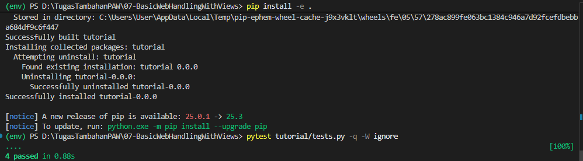
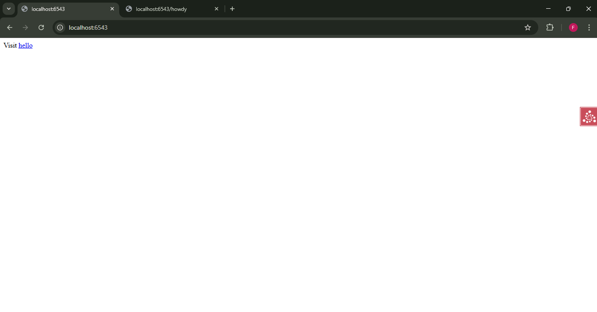
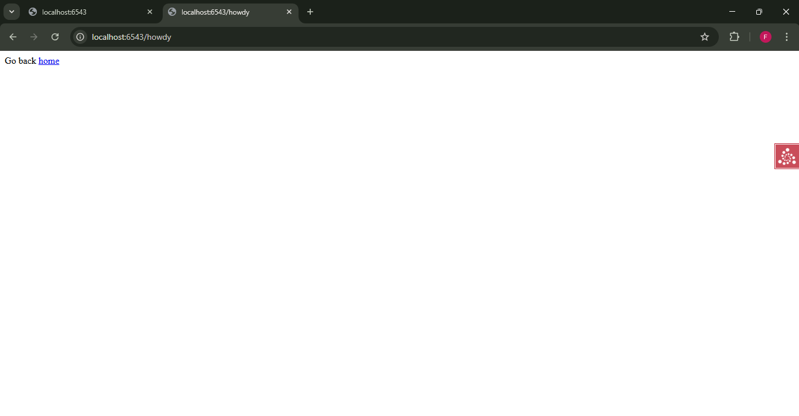

# Analisis Step 07: View Decorators

## Apa yang Dilakukan?
Pada langkah ini, kita melakukan *refactor* (penataan ulang kode) yang signifikan. Kita memindahkan kode *view* (logika yang menangani *request*) dari file `tutorial/__init__.py` ke file baru yang didedikasikan untuk itu, yaitu `tutorial/views.py`.

Kita juga beralih dari konfigurasi *imperative* (menggunakan `config.add_view`) ke konfigurasi *declarative* (menggunakan decorator `@view_config`).

## Konsep

1.  **Refactoring ke `views.py`**:
    File `__init__.py` kita sekarang jauh lebih bersih. Tanggung jawabnya sekarang hanya untuk membuat `Configurator`, menambahkan *routes* (rute), dan memindai *views*. Logika *view* yang sebenarnya (fungsi `home` dan `hello`) sekarang berada di file `views.py` mereka sendiri.

2.  **`config.scan('.views')`**:
    Ini adalah perintah baru yang penting di `__init__.py`. Perintah ini memberi tahu Pyramid untuk "memindai" (scan) file `views.py` (dan file lain di *package* yang sama) untuk mencari *decorator* konfigurasi.

3.  **Declarative (`@view_config`) vs. Imperative (`add_view`)**:
    * **Imperative (Cara Lama)**: Kita secara manual memberi tahu *configurator* apa yang harus dilakukan: `config.add_view(fungsi_hello, route_name='hello')`.
    * **Declarative (Cara Baru)**: Kita "mendekorasi" fungsi *view* kita dengan `@view_config(route_name='hello')`. Ketika `config.scan('.views')` dijalankan, Pyramid akan menemukan *decorator* ini dan secara otomatis melakukan hal yang sama seperti `add_view`.

    Kedua pendekatan ini menghasilkan konfigurasi akhir yang sama. Ini sebagian besar masalah selera dan keterbacaan. Konfigurasi *declarative* menjaga konfigurasi *view* tetap berada di samping kode *view* itu sendiri, yang seringkali lebih mudah dibaca.

4.  **Memperbarui Tests**:
    Karena *views* kita sekarang ada di `views.py` dan konten HTML-nya berubah (menjadi tautan `<a>`), kita harus memperbarui `tests.py` secara signifikan.
    * Kita mengubah *unit test* untuk mengimpor dari `.views` dan memeriksa konten baru (misal `b'Visit'`).
    * Kita mengubah *functional test* untuk menguji URL baru (`/howdy`) dan memeriksa konten baru.
    * Inilah sebabnya `pytest` sekarang menemukan dan meluluskan **4 tes**.

## Cara Menjalankan

1.  Pastikan *virtual environment* (`env`) sudah aktif.
2.  Masuk ke direktori `07-view-decorators`.
3.  Install ulang proyek: `pip install -e .`
4.  Jalankan *test suite* (sekarang ada 4 tes):
    ```bash
    pytest tutorial/tests.py -q -W ignore
    ```
5.  Jalankan server:
    ```bash
    pserve development.ini --reload
    ```
6.  Buka *browser* dan kunjungi `http://localhost:6543/` dan `http://localhost:6543/howdy`.

## Bukti Screenshot

1.  Terminal yang menjalankan `pytest` dengan pesan bersih "4 passed".

2.  Browser yang menampilkan salah satu halaman baru (misal `http://localhost:6543/howdy`).

