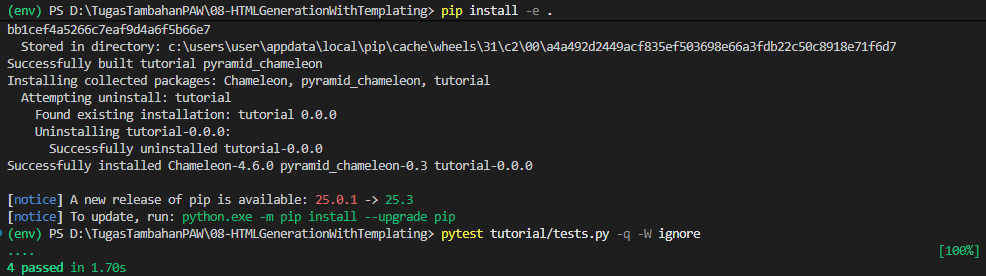
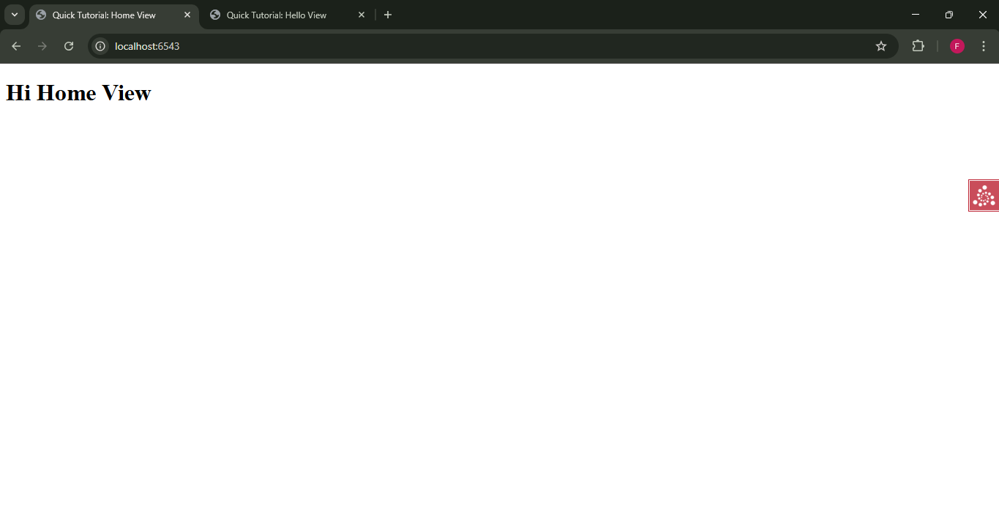
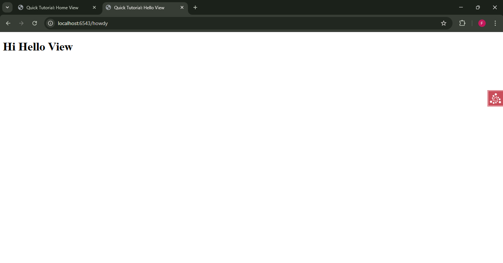

# Analisis Step 08: Templating

## Apa yang Dilakukan?
Pada langkah ini, kita sepenuhnya memisahkan logika aplikasi (Python) dari presentasi (HTML). Kita menambahkan `pyramid_chameleon` sebagai *template engine* kita.

File `views.py` kita sekarang tidak lagi mengembalikan `Response` HTML. Sebaliknya, mereka hanya mengembalikan *dictionary* Python. Pyramid kemudian mencegat *dictionary* ini, dan (karena kita menentukan `renderer` di `@view_config`) meneruskannya ke *template* `home.pt` untuk di-*render* menjadi HTML.

## Konsep

1.  **`pyramid_chameleon`**:
    Ini adalah *template engine* resmi untuk Pyramid. Kita menambahkannya sebagai dependensi inti di `setup.py` dan mengaktifkannya di `__init__.py` menggunakan `config.include('pyramid_chameleon')`.

2.  **`renderer='home.pt'`**:
    Ini adalah perubahan kunci di `@view_config` (dalam `views.py`). Atribut `renderer` ini memberi tahu Pyramid untuk menggunakan file `tutorial/home.pt` untuk me-*render* respons.

3.  **View Mengembalikan Dictionary**:
    Fungsi *view* kita (misal `home`) sekarang sangat bersih. Tugasnya hanya mengumpulkan data dan mengembalikannya sebagai *dictionary* (misal `{'name': 'Home View'}`). Pyramid secara otomatis meneruskan *dictionary* ini ke *renderer*.

4.  **Template (`home.pt`)**:
    Ini adalah file HTML kita. *Engine* Chameleon mencari sintaks `${...}` (misal `${name}`) dan menggantinya dengan nilai yang sesuai dari *dictionary* yang dikirim oleh *view*.

5.  **`pyramid.reload_templates = true`**:
    Ditambahkan ke `development.ini`, ini adalah pengaturan kenyamanan. Ini memberi tahu Pyramid untuk memuat ulang file *template* (`.pt`) jika ada perubahan, tanpa perlu me-restart server `pserve`.

6.  **Dampak pada Testing**:
    Perubahan ini berdampak besar pada cara kita menguji:
    * **Unit Tests** (`TutorialViewTests`): Sekarang menguji "kontrak data" murni. Kita tidak lagi peduli dengan HTML. Kita hanya memeriksa apakah *view* mengembalikan *dictionary* yang benar. (misal `self.assertEqual('Home View', response['name'])`).
    * **Functional Tests** (`TutorialFunctionalTests`): Sekarang menguji hasil akhir yang sudah di-*render*. Kita memeriksa apakah *browser* (via `webtest`) menerima HTML yang benar setelah *template* digabungkan dengan data. (misal `self.assertIn(b'<h1>Hi Home View</h1>', res.body)`).

## Cara Menjalankan

1.  Pastikan *virtual environment* (`env`) sudah aktif.
2.  Masuk ke direktori `08-templating`.
3.  Install dependensi baru (`pyramid_chameleon`):
    ```bash
    pip install -e .
    ```
4.  Jalankan *test suite* (sekarang ada 4 tes yang diperbarui):
    ```bash
    pytest tutorial/tests.py -q -W ignore
    ```
5.  Jalankan server:
    ```bash
    pserve development.ini --reload
    ```
6.  Buka *browser* dan kunjungi `http://localhost:6543/` dan `http://localhost:6543/howdy`.

## Bukti Screenshot
1.  Terminal yang menjalankan `pytest` dengan pesan bersih "4 passed".

2.  Browser yang menampilkan halaman yang sudah di-*render* (misal `http://localhost:6543/` yang menunjukkan "Hi Home View").

