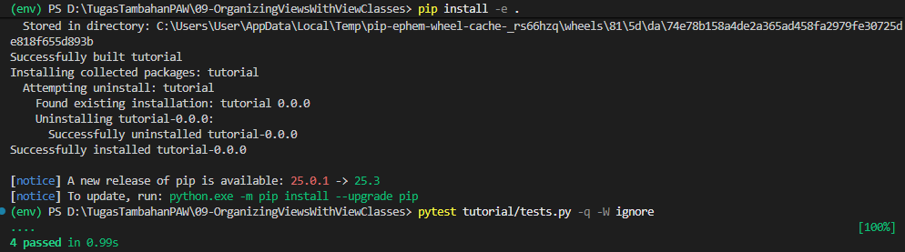
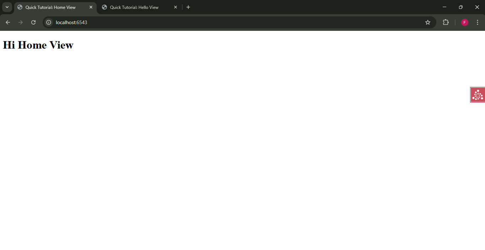
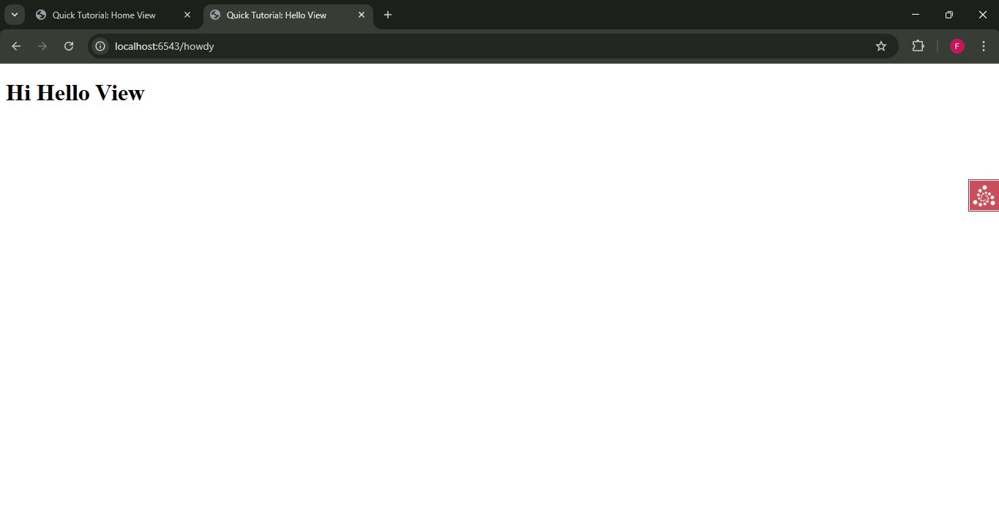

# Analisis Step 09: View Classes

## Apa yang Dilakukan?
Pada langkah ini, kita tidak menambahkan fungsionalitas baru. Kita hanya melakukan *refactor* (penataan ulang) kode *view* kita dari yang tadinya berupa fungsi-fungsi terpisah menjadi *methods* (metode) di dalam sebuah *class* (kelas) tunggal bernama `TutorialViews`.

## Konsep

1.  **Pengelompokan Logis**:
    Dengan menggunakan *class*, kita bisa mengelompokkan *view* yang terkait secara logis (`home` dan `hello`) di satu tempat. Ini membuat kode lebih rapi dan terorganisir.

2.  **`@view_defaults`**:
    Ini adalah *decorator* baru yang kita terapkan di level *class*. Karena kedua *view* kita menggunakan *renderer* yang sama (`home.pt`), kita bisa "mengangkat" konfigurasi tersebut ke *class* menggunakan `@view_defaults(renderer='home.pt')`. Ini berlaku untuk semua *method* `@view_config` di dalam *class* tersebut, sehingga kita tidak perlu menuliskannya berulang kali.

3.  **`__init__(self, request)`**:
    Saat Pyramid menggunakan *view class*, ia akan membuat *instance* dari *class* tersebut untuk setiap *request*. Konstruktor `__init__` menerima `request` dan menyimpannya sebagai `self.request`, sehingga semua *method* lain di dalam *class* (seperti `home` dan `hello`) bisa mengaksesnya jika diperlukan (meskipun dalam contoh ini kita belum menggunakannya).

4.  **Dampak pada Unit Testing**:
    *Unit test* kita perlu diubah secara signifikan.
    * Kita sekarang mengimpor *class* (`from .views import TutorialViews`), bukan fungsi.
    * Kita harus membuat `DummyRequest` terlebih dahulu.
    * Kemudian, kita harus **membuat *instance*** dari *class* tersebut, dengan meneruskan *request* palsu: `inst = TutorialViews(request)`.
    * Terakhir, kita memanggil *method* pada *instance* tersebut: `response = inst.home()`.

5.  **Dampak pada Functional Testing**:
    *Functional test* kita (`TutorialFunctionalTests`) **tidak berubah sama sekali**. Ini adalah poin penting. *Functional test* menguji aplikasi dari "luar" (seperti *browser*). Ia tidak peduli *bagaimana* *view* diimplementasikan (apakah itu fungsi atau *class*); ia hanya peduli bahwa mengunjungi URL `/` akan mengembalikan HTML yang benar.

## Cara Menjalankan

1.  Pastikan *virtual environment* (`env`) sudah aktif.
2.  Masuk ke direktori `09-view-classes`.
3.  Install ulang proyek: `pip install -e .`
4.  Jalankan *test suite* (4 tes):
    ```bash
    pytest tutorial/tests.py -q -W ignore
    ```
5.  Jalankan server:
    ```bash
    pserve development.ini --reload
    ```
6.  Buka *browser* dan kunjungi `http://localhost:6543/` dan `http://localhost:6543/howdy`.

## Bukti Screenshot

(Tempelkan screenshot Anda di sini. Tampilkan dua hal):
1.  Terminal yang menjalankan `pytest` dengan pesan bersih "4 passed".

2.  Browser yang menampilkan halaman yang sudah di-*render* (misal `http://localhost:6543/`).

