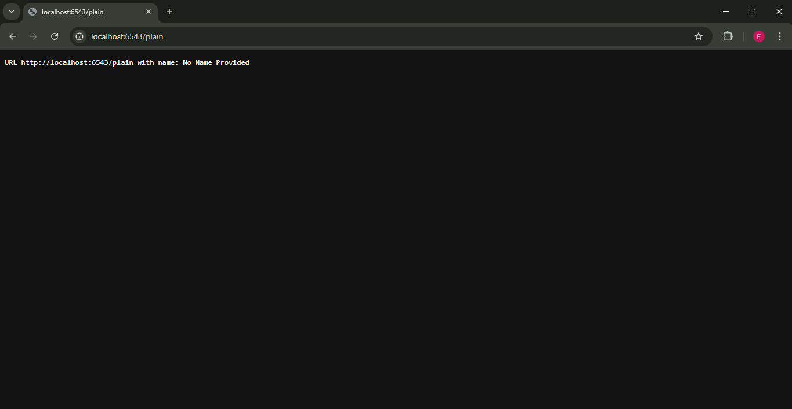
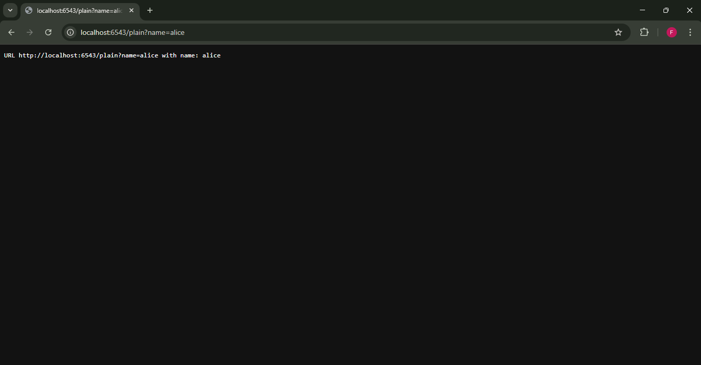

# Analisis Step 10: Handling Web Requests and Responses

## Apa yang Dilakukan?
Pada langkah ini, kita membuat aplikasi kita benar-benar dinamis. Kita memodifikasi salah satu rute (`hello`) untuk menerima bagian URL yang dinamis. *View* kita sekarang membaca bagian URL tersebut dari objek `request` dan meneruskannya ke *template*.

## Konsep

1.  **Rute Dinamis (`/howdy/{first}`)**:
    Di `tutorial/__init__.py`, kita mengubah rute kita dari `'/howdy'` menjadi `'/howdy/{first}'`. Sintaks `{first}` adalah "placeholder" dinamis. Ini berarti Pyramid akan mencocokkan URL apa pun seperti `/howdy/John`, `/howdy/Jane`, dll., dan menyimpan nilainya (`John`, `Jane`) ke dalam variabel bernama `first`.

2.  **`request.matchdict`**:
    Ini adalah properti dari objek `request` yang paling penting di *step* ini. `matchdict` adalah *dictionary* yang berisi nilai-nilai yang ditangkap oleh "placeholder" dinamis di rute.
    * Di `views.py` (dalam *method* `hello`), kita menggunakan `first = self.request.matchdict['first']` untuk mengambil nilai yang ditangkap dari URL.

3.  **Alur Data (Data Flow)**:
    Alur data sekarang menjadi:
    1.  Pengguna mengunjungi `/howdy/NamaAnda`.
    2.  Pyramid mencocokkan ini dengan rute `hello` dan tahu bahwa `{'first': 'NamaAnda'}`.
    3.  Pyramid membuat *instance* `TutorialViews` dengan `request` yang berisi `matchdict` ini.
    4.  Pyramid memanggil *method* `hello`.
    5.  *Method* `hello` mengambil `'NamaAnda'` dari `self.request.matchdict['first']`.
    6.  *Method* `hello` mengembalikan `{'name': 'NamaAnda'}`.
    7.  *Renderer* (`home.pt`) mengambil *dictionary* ini dan me-*render* HTML: `<h1>Hi NamaAnda</h1>`.

4.  **Dampak pada Unit Testing**:
    *Unit test* kita (`TutorialViewTests`) harus **memalsukan (fake)** `matchdict` karena tidak ada URL nyata yang dipanggil. Kita melakukan ini dengan menambahkan `request.matchdict['first'] = 'TestUser'` ke `DummyRequest` kita sebelum memanggil *view*.

5.  **Dampak pada Functional Testing**:
    *Functional test* kita (`TutorialFunctionalTests`) sekarang dapat memanggil URL dinamis secara langsung (misal `self.testapp.get('/howdy/TestUser', ...)`) dan memeriksa apakah HTML yang di-*render* berisi data dinamis tersebut.

## Cara Menjalankan

1.  Pastikan *virtual environment* (`env`) sudah aktif.
2.  Masuk ke direktori `10-request-response`.
3.  Install ulang proyek: `pip install -e .`
4.  Jalankan *test suite* (4 tes yang diperbarui):
    ```bash
    pytest tutorial/tests.py -q -W ignore
    ```
5.  Jalankan server:
    ```bash
    pserve development.ini --reload
    ```
6.  Buka *browser* dan kunjungi URL dinamis, misal: `http://localhost:6543/howdy/NamaAnda`.

## Bukti Screenshot


