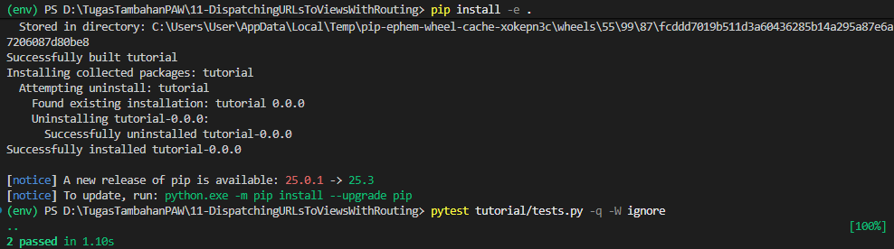
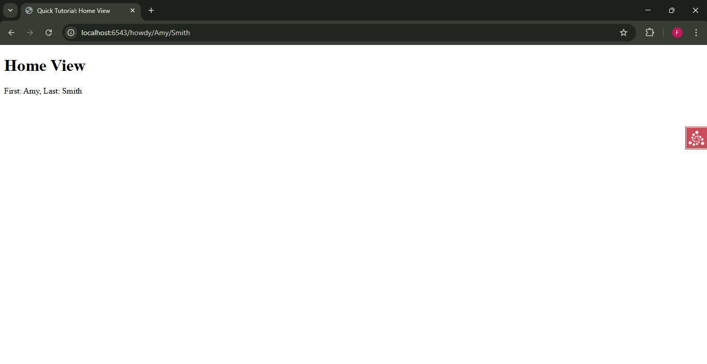

# Analisis Step 11: Routing

## Apa yang Dilakukan?
Pada langkah ini, kita membuat rute kita lebih canggih dengan menambahkan beberapa "replacement patterns" (pola pengganti) ke dalam satu rute. Kita mengubah rute `home` kita untuk menangkap dua bagian dinamis dari URL (`first` dan `last`).

## Konsep

1.  **Multiple Replacement Patterns**:
    Di `__init__.py`, kita mendeklarasikan rute baru:
    `config.add_route('home', '/howdy/{first}/{last}')`
    Ini memberi tahu `Configurator` bahwa URL kita sekarang memiliki dua "placeholder". URL seperti `/howdy/amy/smith` akan dicocokkan, dengan `amy` disimpan sebagai `first` dan `smith` sebagai `last`.

2.  **`request.matchdict` (Lagi)**:
    Seperti di *step* sebelumnya, `request.matchdict` adalah *dictionary* yang berisi nilai-nilai dari URL.
    * `self.request.matchdict['first']` akan berisi `amy`.
    * `self.request.matchdict['last']` akan berisi `smith`.
    Informasi ini kemudian dapat digunakan di mana saja di dalam *view* yang memiliki akses ke `request`.

3.  **Dampak pada Template**:
    *Template* `home.pt` kita diperbarui untuk menampilkan data baru ini, menggunakan sintaks `${first}` dan `${last}`.

4.  **Dampak pada Testing**:
    * **Unit Tests**: Kita sekarang harus memalsukan (mock) *kedua* nilai `matchdict` di `DummyRequest` kita (misal, `request.matchdict['first'] = 'First'` dan `request.matchdict['last'] = 'Last'`). Tes kita juga sekarang memeriksa apakah *dictionary* yang dikembalikan oleh *view* berisi kedua nilai ini.
    * **Functional Tests**: Tes kita sekarang memanggil URL yang lebih kompleks (misal, `self.testapp.get('/howdy/Jane/Doe', ...)`). Kita juga sekarang memeriksa apakah *kedua* nama tersebut (`Jane` dan `Doe`) muncul di hasil akhir HTML.

## Cara Menjalankan

1.  Pastikan *virtual environment* (`env`) sudah aktif.
2.  Masuk ke direktori `11-routing`.
3.  Install ulang proyek: `pip install -e .`
4.  Jalankan *test suite* (sekarang ada 2 tes):
    ```bash
    pytest tutorial/tests.py -q -W ignore
    ```
5.  Jalankan server:
    ```bash
    pserve development.ini --reload
    ```
6.  Buka *browser* dan kunjungi URL dinamis, misal: `http://localhost:6543/howdy/NamaAnda/Disini`.

## Bukti Screenshot

(Tempelkan screenshot Anda di sini. Tampilkan dua hal):
1.  Terminal yang menjalankan `pytest` dengan pesan bersih "2 passed".

2.  Browser yang mengunjungi URL dinamis (seperti `.../howdy/Amy/Smith`) dan menampilkan konten dinamis ("First: Amy, Last: Smith").

