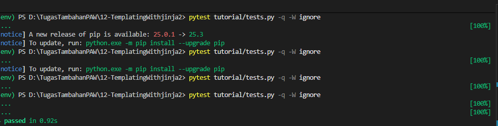
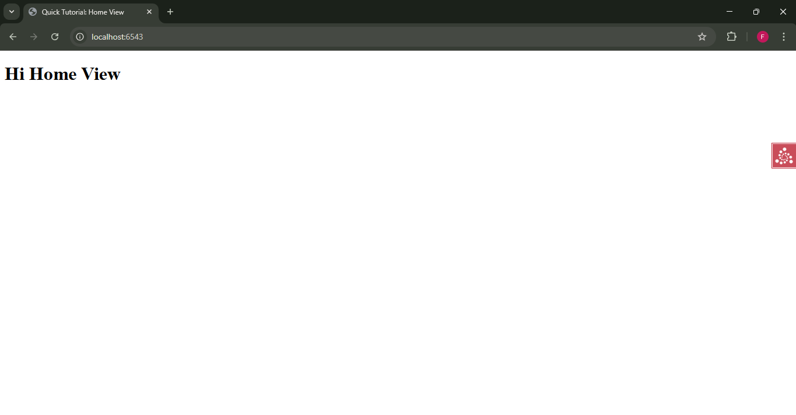

# Analisis Step 12: Templating With jinja2

## Apa yang Dilakukan?
Pada langkah ini, kita mengganti *template engine* kita. Kita beralih dari *renderer* default Pyramid, Chameleon (`.pt`), ke *renderer* populer lainnya, Jinja2 (`.jinja2`). Ini menunjukkan fleksibilitas Pyramid.

## Konsep

1.  **`pyramid_jinja2`**:
    Ini adalah *add-on* eksternal yang menyediakan integrasi Jinja2 untuk Pyramid. Kita menambahkannya sebagai dependensi inti di `setup.py`.

2.  **`config.include('pyramid_jinja2')`**:
    Sama seperti *add-on* lainnya (`pyramid_chameleon` atau `pyramid_debugtoolbar`), kita harus memberi tahu `Configurator` kita untuk memuatnya. Perintah ini di `__init__.py` mendaftarkan *renderer* baru yang mencari file `.jinja2`.

3.  **Perubahan *Renderer***:
    Di `views.py`, kita hanya mengubah nama *renderer* di `@view_defaults` dari `'home.pt'` menjadi `'home.jinja2'`. Kode *view* lainnya (yang mengembalikan *dictionary*) tetap sama persis.

4.  **Sintaks Template**:
    Perbedaan utama yang terlihat adalah sintaks di dalam file *template*.
    * **Chameleon (lama)**: `${name}`
    * **Jinja2 (baru)**: `{{ name }}`

5.  **Dampak pada Testing**:
    Tidak ada. Karena *view* kita masih mengembalikan *dictionary* yang sama (yang diuji oleh *unit test*) dan HTML yang di-*render* secara fungsional identik (yang diuji oleh *functional test*), file `tests.py` kita dari Step 09 tidak memerlukan perubahan apa pun. Inilah sebabnya kita masih melihat "4 passed".

## Cara Menjalankan

1.  Pastikan *virtual environment* (`env`) sudah aktif.
2.  Masuk ke direktori `12-jinja2`.
3.  Install dependensi baru (`pyramid_jinja2`):
    ```bash
    pip install -e .
    ```
4.  Jalankan *test suite* (4 tes yang sama):
    ```bash
    pytest tutorial/tests.py -q -W ignore
    ```
5.  Jalankan server:
    ```bash
    pserve development.ini --reload
    ```
6.  Buka *browser* dan kunjungi `http://localhost:6543/` dan `http://localhost:6543/howdy`.

## Bukti Screenshot

(Tempelkan screenshot Anda di sini. Tampilkan dua hal):
1.  Terminal yang menjalankan `pytest` dengan pesan bersih "4 passed".

2.  Browser yang menampilkan halaman yang sudah di-*render* (misal `http://localhost:6F543/` yang menunjukkan "Hi Home View").
