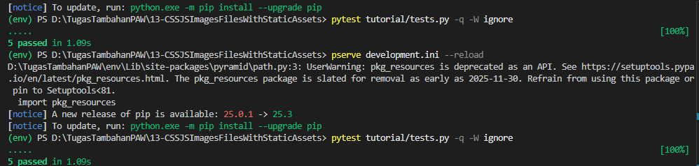
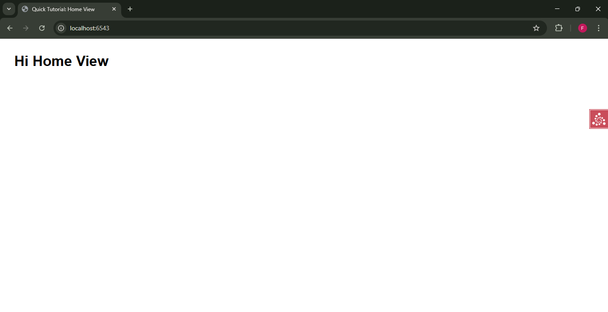

# Analisis Step 13: Static Assets (CSS/JS/Images)

## Apa yang Dilakukan?
Pada langkah ini, kita mengubah aplikasi WSGI kita untuk memetakan permintaan di bawah URL `/static/` ke file dan direktori di dalam direktori `static` di dalam *package* `tutorial` kita. Direktori ini berisi satu file `app.css`.

Kita juga menautkan file CSS ini di dalam *template* kita untuk mengubah tampilan halaman.

## Konsep

1.  **`config.add_static_view`**:
    Ini adalah perintah kunci di `__init__.py`. Perintah ini memberi tahu Pyramid untuk membuat *view* khusus yang menyajikan file.
    * `name='static'`: Ini adalah awalan URL. Semua permintaan ke `http://localhost:6543/static/...` akan ditangani oleh *view* ini.
    * `path='tutorial:static'`: Ini adalah *asset specification* yang menunjuk ke lokasi file di dalam *package* kita. Ini berarti "cari folder bernama `static` di dalam *package* `tutorial`".

2.  **`request.static_url`**:
    Di dalam *template* `home.pt`, kita menggunakan *helper* `request.static_url` untuk menghasilkan URL yang benar ke file CSS kita.
    * `href="${request.static_url('tutorial:static/app.css') }"`
    * Kita bisa saja menulis `href="/static/app.css"` secara *hard-code*. Namun, menggunakan `request.static_url` jauh lebih fleksibel.
    * **Keuntungan**: Jika kita nanti mengubah `add_static_view` (misal `name='assets'`), `request.static_url` akan secara otomatis menghasilkan URL baru (`/assets/app.css`) tanpa kita harus mengedit *template*.

3.  **Dampak pada Testing**:
    Kita menambahkan *functional test* baru, `test_css`. Tes ini secara langsung meminta `/static/app.css` dari `webtest` dan memeriksa apakah responsnya sukses (status 200) dan berisi konten yang diharapkan (kata `body`). Ini menambah total tes kita menjadi 5.

## Cara Menjalankan

1.  Pastikan *virtual environment* (`env`) sudah aktif.
2.  Masuk ke direktori `13-static-assets`.
3.  Install ulang proyek: `pip install -e .`
4.  Jalankan *test suite* (sekarang ada 5 tes):
    ```bash
    pytest tutorial/tests.py -q -W ignore
    ```
5.  Jalankan server:
    ```bash
    pserve development.ini --reload
    ```
6.  Buka *browser* dan kunjungi `http://localhost:6543/`. Perhatikan perubahan *font*.

## Bukti Screenshot

1.  Terminal yang menjalankan `pytest` dengan pesan bersih "5 passed".

2.  Browser yang mengunjungi halaman utama (`http://localhost:6543/`) yang menunjukkan *font* baru (`sans-serif`).
