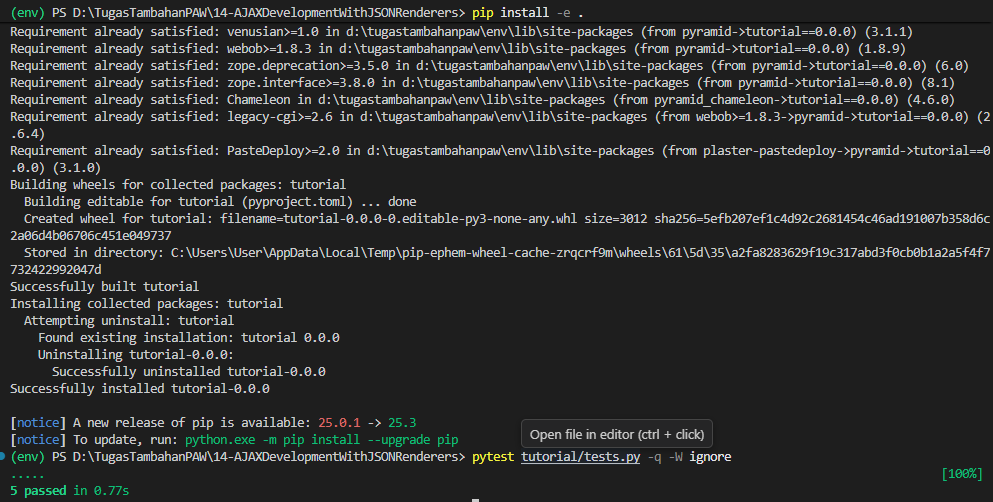
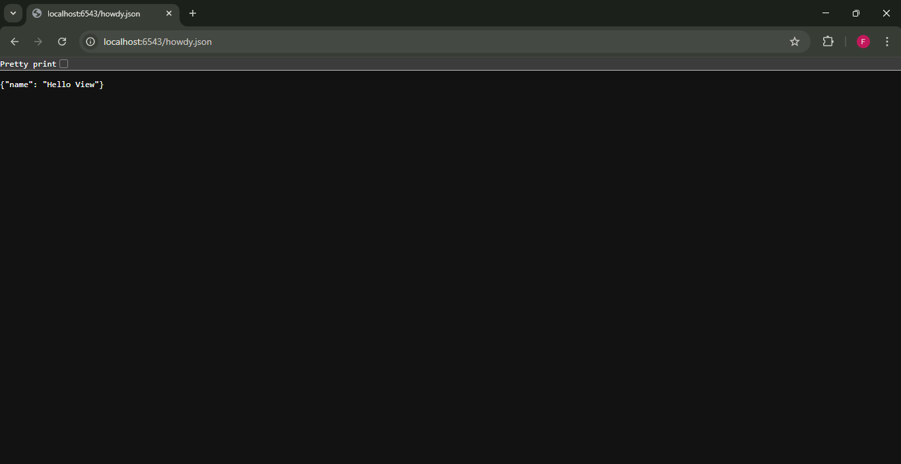

# Analisis Step 14: AJAX Development (JSON Renderers)

## Apa yang Dilakukan?
Pada langkah ini, kita mengubah *view* kita yang sudah ada (`hello`) agar dapat merespons dalam format JSON ketika rute yang berbeda (`/howdy.json`) dipanggil. Ini menunjukkan bagaimana satu *method* *view* dapat menangani beberapa rute dan *renderer* yang berbeda.

## Konsep

1.  **Renderer JSON Bawaan**:
    Pyramid memiliki *renderer* `json` bawaan. Tidak seperti `pyramid_chameleon` atau `pyramid_jinja2`, kita tidak perlu meng-install atau meng-include *package* tambahan untuk menggunakannya.

2.  **Menumpuk (Stacking) Decorators**:
    Di `views.py`, kita "menumpuk" *decorator* `@view_config` kedua di atas *method* `hello`.
    * `@view_config(route_name='hello')`: Ini terhubung ke *renderer* default *class* (`home.pt`).
    * `@view_config(route_name='hello_json', renderer='json')`: Ini terhubung ke rute baru (`/howdy.json`) dan **mengganti (overrides)** *renderer* default, secara spesifik memintanya untuk menggunakan `renderer='json'`.

3.  **Alur Data (Data Flow) untuk JSON**:
    1.  Pengguna mengunjungi `/howdy.json`.
    2.  Pyramid mencocokkan ini dengan rute `hello_json`.
    3.  Pyramid melihat bahwa `hello_json` dipetakan ke *method* `hello` di `TutorialViews`.
    4.  *Decorator* yang cocok (`@view_config(route_name='hello_json', ...)`) memberi tahu Pyramid untuk menggunakan `renderer='json'`.
    5.  *Method* `hello` dieksekusi dan mengembalikan *dictionary* Python: `{'name': 'Hello View'}`.
    6.  *Renderer* `json` mengambil *dictionary* tersebut dan mengubahnya menjadi string JSON (`{"name": "Hello View"}`) dan mengatur `Content-Type` *header* respons menjadi `application/json`.

4.  **Dampak pada Testing**:
    Kita menambahkan *functional test* baru, `test_hello_json`. Tes ini sangat penting karena memverifikasi dua hal:
    * `self.assertEqual(res.content_type, 'application/json')`: Memeriksa apakah *header* HTTP sudah benar.
    * `self.assertIn(b'{"name": "Hello View"}', res.body)`: Memeriksa apakah *body* respons berisi string JSON yang benar.
    Ini menambah total tes kita menjadi 5.

## Cara Menjalankan

1.  Pastikan *virtual environment* (`env`) sudah aktif.
2.  Masuk ke direktori `14-json-ajax`.
3.  Install ulang proyek: `pip install -e .`
4.  Jalankan *test suite* (sekarang ada 5 tes):
    ```bash
    pytest tutorial/tests.py -q -W ignore
    ```
5.  Jalankan server:
    ```bash
    pserve development.ini --reload
    ```
6.  Buka *browser* dan kunjungi `http://localhost:6543/howdy.json` untuk melihat respons JSON.

## Bukti Screenshot

1.  Terminal yang menjalankan `pytest` dengan pesan bersih "5 passed".

2.  Browser yang mengunjungi `http://localhost:6543/howdy.json` dan menampilkan teks JSON mentah.
