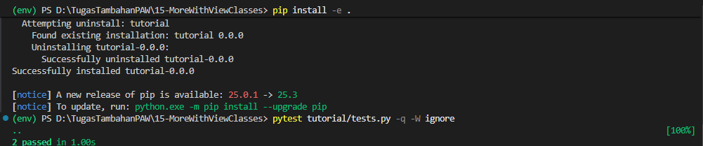
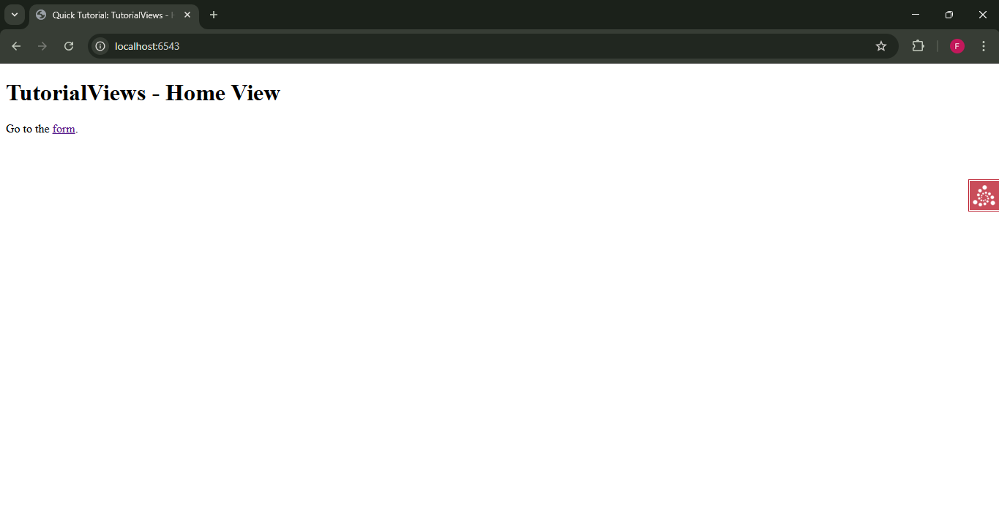
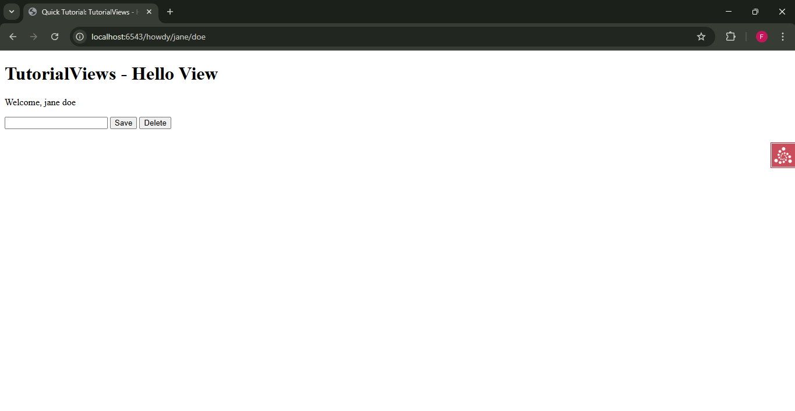
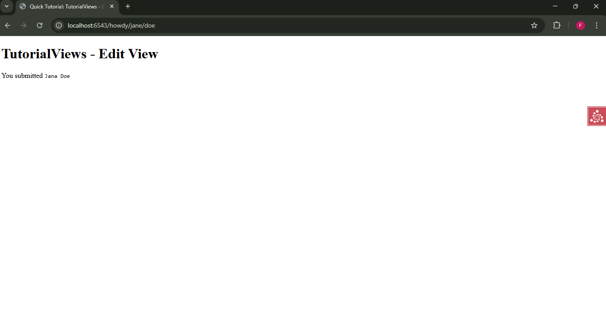
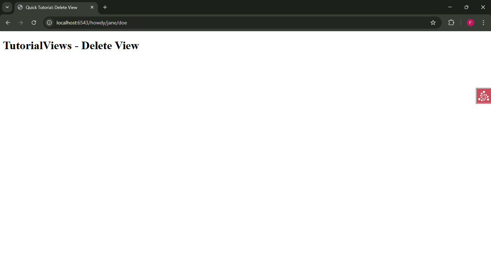

# Analisis Step 15: More With View Classes

## Apa yang Dilakukan?
Pada langkah ini, kita menggabungkan semua konsep sebelumnya untuk membuat *view class* yang canggih. Kita sekarang memiliki empat *view* yang dikelompokkan secara logis di dalam `TutorialViews`. Kita menggunakan kriteria seperti metode HTTP (GET/POST) dan parameter form untuk menentukan *view* mana yang akan digunakan untuk rute yang sama.

## Konsep

1.  **Satu Rute, Banyak View**:
    Rute `/howdy/{first}/{last}` (bernama `hello`) sekarang dilayani oleh **tiga** *method* *view* yang berbeda (`hello`, `edit`, `delete`). Pyramid memutuskan mana yang akan digunakan berdasarkan kriteria *request*.

2.  **View Predicates (Kriteria View)**:
    Kita menggunakan *decorator* `@view_config` dengan argumen tambahan untuk memfilter *request*:
    * **GET (Default)**: `@view_config(renderer='hello.pt')` menangani *request* GET biasa ke rute `hello` (saat pertama kali memuat halaman form).
    * **POST (Edit)**: `@view_config(request_method='POST', renderer='edit.pt')` menangani *request* POST ke rute `hello` (saat tombol "Save" ditekan).
    * **POST (Delete)**: `@view_config(request_method='POST', request_param='form.delete', renderer='delete.pt')` adalah yang paling spesifik. Ini *hanya* menangani *request* POST yang juga berisi parameter form `form.delete` (saat tombol "Delete" ditekan).

3.  **Berbagi State dan Logika di Class**:
    * **State (`self.view_name`)**: Kita menetapkan `self.view_name = 'TutorialViews'` di `__init__`. Nilai ini sekarang tersedia untuk *semua* *method* *view* dan juga *semua* *template* (via `${view.view_name}`).
    * **Computed Value (`@property full_name`)**: Kita membuat *property* `full_name` yang menghitung nama lengkap dari `matchdict`. Ini juga bisa digunakan di *template* manapun (via `${view.full_name}`).

4.  **Generasi URL (`request.route_url`)**:
    Di *template* kita, kita berhenti melakukan *hard-coding* URL (seperti `<a href="/howdy/jane/doe">`). Sebagai gantinya, kita menggunakan *helper* `request.route_url`.
    * `${request.route_url('hello', first='jane', last='doe')}`
    * Ini menghasilkan URL secara dinamis berdasarkan nama rute (`hello`) dan parameternya. Ini jauh lebih fleksibel; jika kita mengubah URL rute `hello` di `__init__.py`, link ini akan otomatis diperbarui.

5.  **Menyederhanakan Tes**:
    Tutorial ini menyederhanakan file `tests.py` untuk *step* ini, hanya menyisakan dua tes `test_home` (satu unit, satu fungsional). Ini agar fokusnya tetap pada logika *view class* yang baru, meskipun dalam proyek nyata kita akan menambahkan tes untuk *view* `edit` dan `delete` juga.

## Cara Menjalankan

1.  Pastikan *virtual environment* (`env`) sudah aktif.
2.  Masuk ke direktori `15-more-view-classes`.
3.  Install ulang proyek: `pip install -e .`
4.  Jalankan *test suite* (hanya 2 tes):
    ```bash
    pytest tutorial/tests.py -q -W ignore
    ```
5.  Jalankan server:
    ```bash
    pserve development.ini --reload
    ```
6.  Buka *browser* dan kunjungi `http://localhost:6543/`, lalu klik link untuk pergi ke `http://localhost:6543/howdy/jane/doe`. Coba klik tombol "Save" dan "Delete".

## Bukti Screenshot
1.  Terminal yang menjalankan `pytest` dengan pesan bersih "2 passed".

2.  Browser yang mengunjungi `.../howdy/jane/doe` (menampilkan form).


3.  Browser setelah Anda menekan tombol "Save" (menampilkan halaman "You submitted...").


